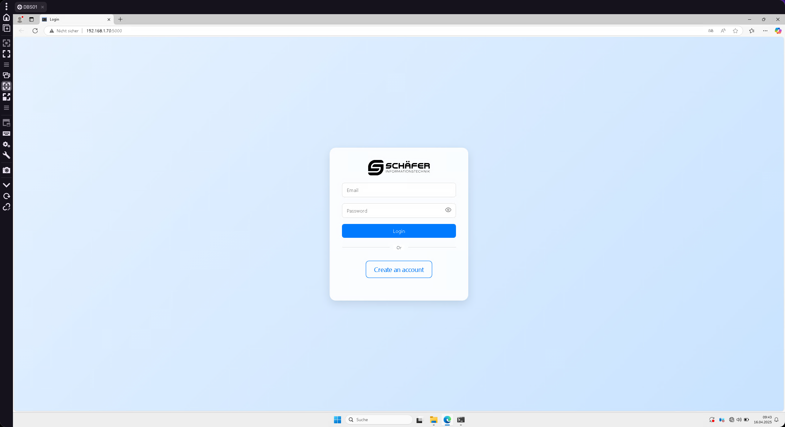
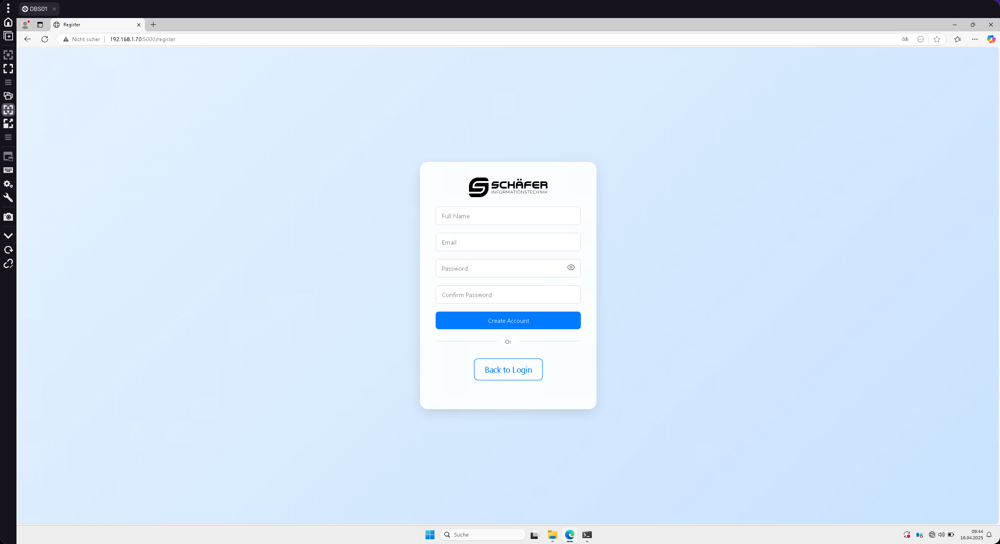
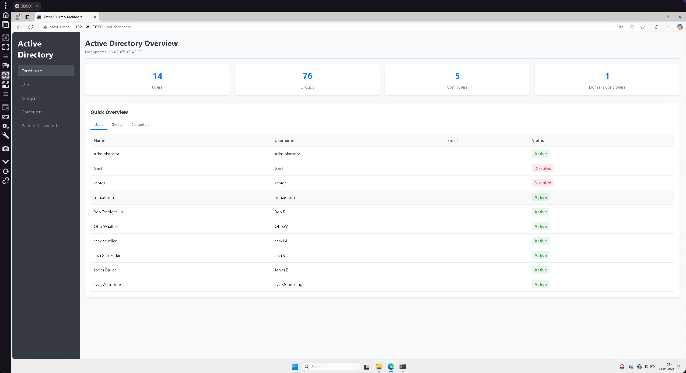
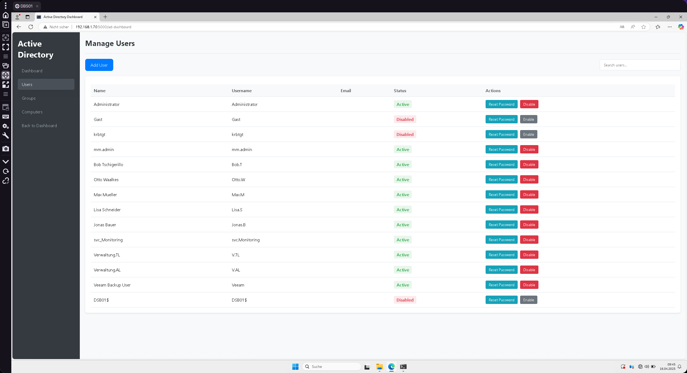
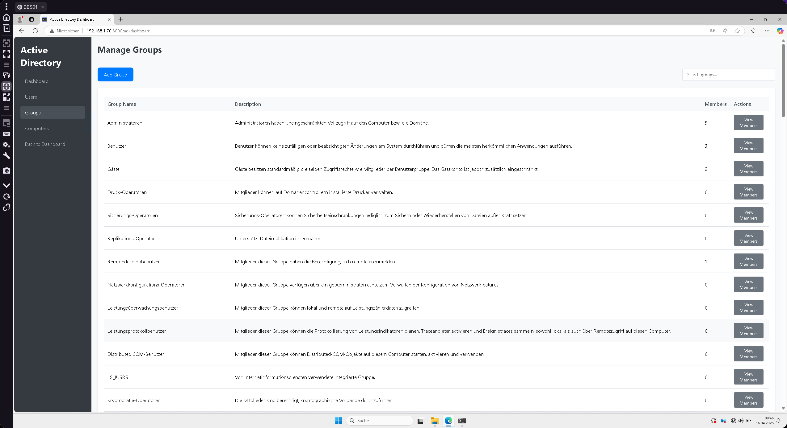
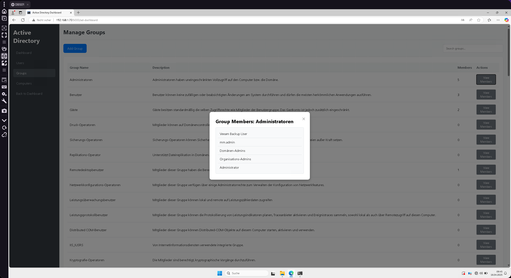
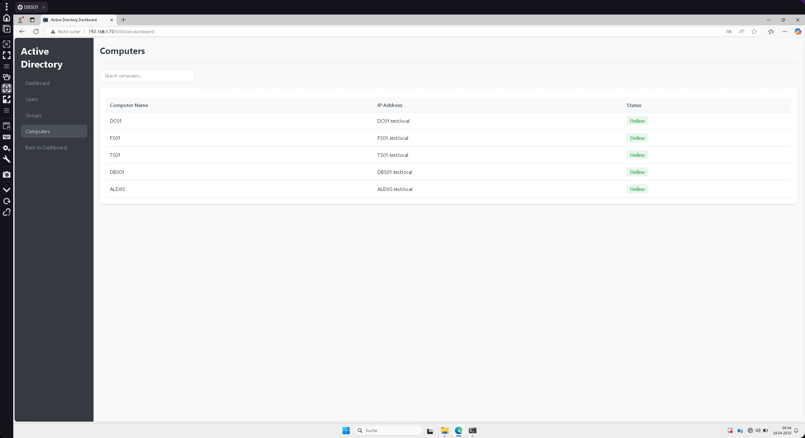

# Active Directory Remote Managment System

A complete AD Remote system with HTML, CSS, and JavaScript frontend and Python backend.

## Features
- Beautiful animated login UI
- User registration functionality
- Backend authentication with Python and SQLite
- Landing page after successful login
- User controll [Activation Status Change, Password change]
- View Computers in the domain
- View Groups and Members of the domain

## Structure
- `static/` - Contains CSS and JavaScript files
- `templates/` - Contains HTML templates
- `app.py` - Main Python application
- `database.py` - Database operations

## How to Run
1. Install the required dependencies:
   ```
   pip install -r requirements.txt
   ```
2. Run the application:
   ```
   python app.py
   ```
3. Open your browser and navigate to `http://localhost:5000`

## Preview :







